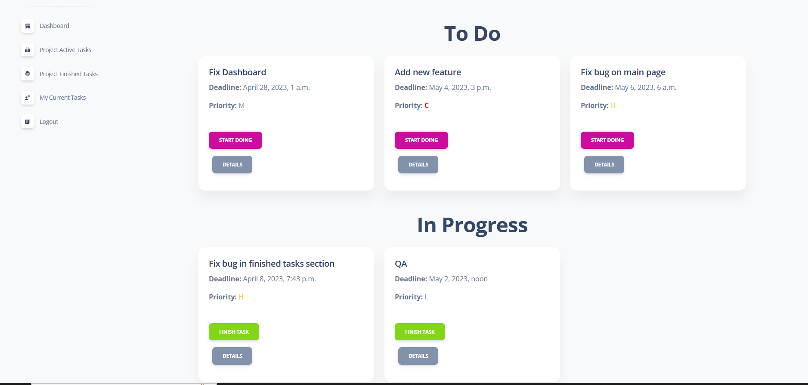
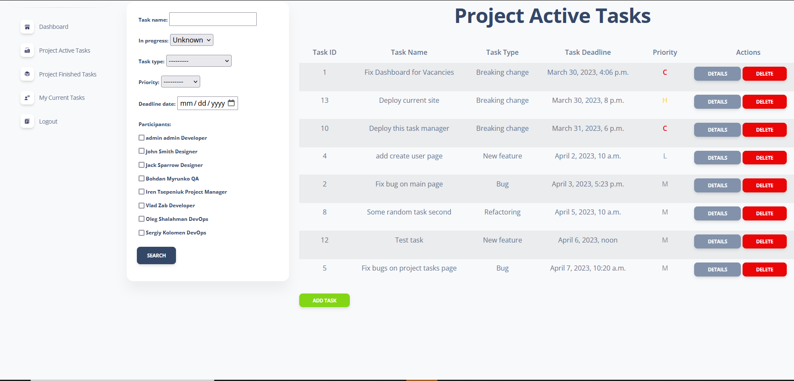
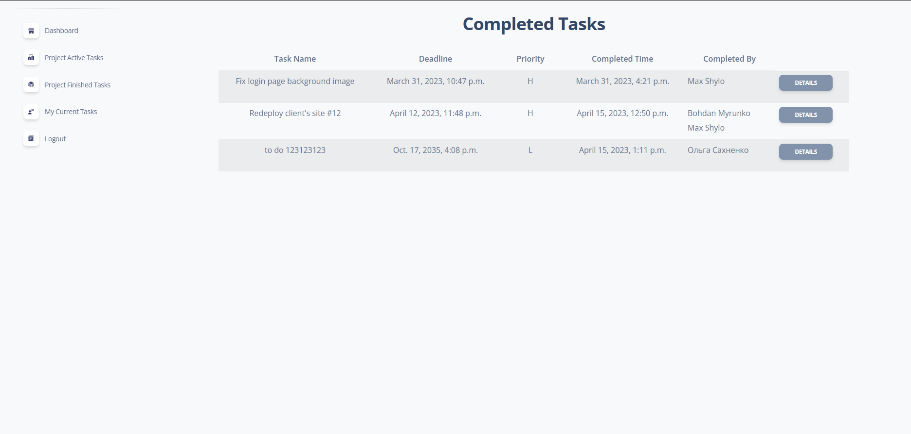

# Task-manager Project

Django project for managing and control tasks.Currently available for single 
team and single project. It provides ability to control personal tasks
and basic filter for PM or person who wants to understand whole scope of
project tasks.

## Check it out!

Test User:
- login: best_qa 
- password: 1qazcde3

[Task Manager Deployed to Render](https://task-manager-6k1p.onrender.com/)

## Installation

Python3 must be already installed

```shell
git clone https://github.com/ZabFTFT/task-manager.git
cd task-manager
python -m venv venv
```
```shell
venv\Scripts\activate (on Windows)
source venv/bin/activate (on macOS)
```
```shell
pip install -r requirements.txt
python manage.py runserver # starts Django server
```

## Features

* Managing personal tasks
* Managing team tasks
* Checkout history of tasks and their details

## Demo




